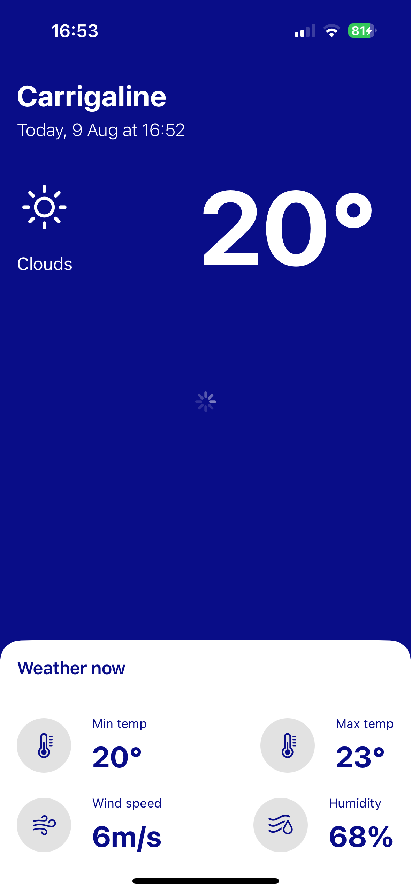

# iOS Weather App

A simple iOS weather app built with **SwiftUI** and **CoreLocation**.  
It fetches your current location and displays real-time weather data using the **OpenWeather API**.

---

## Features
-  Get your current location using CoreLocation
-  Fetch current weather from OpenWeather
-  Modern SwiftUI interface with dark mode
-  Supports iOS 15+ and latest Apple APIs

---
## How It Works
- Request Location – Uses CoreLocation & CoreLocationUI to get coordinates.
- Fetch Weather – Sends coordinates to the OpenWeather API.
- Display Data – Presents weather info in a SwiftUI layout.
